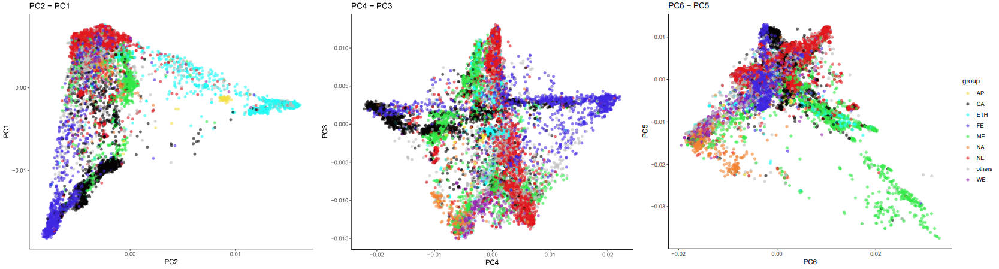
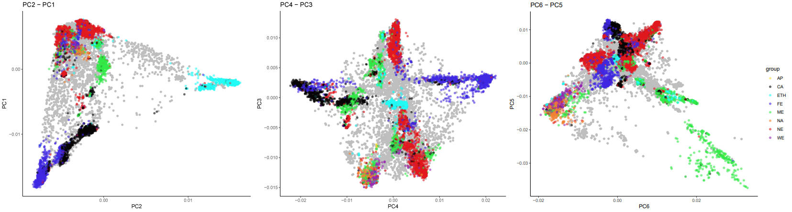
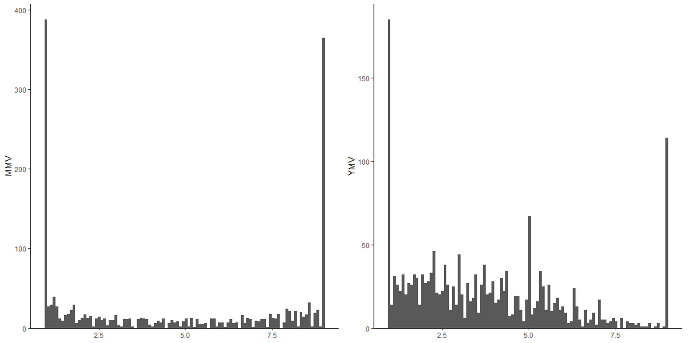
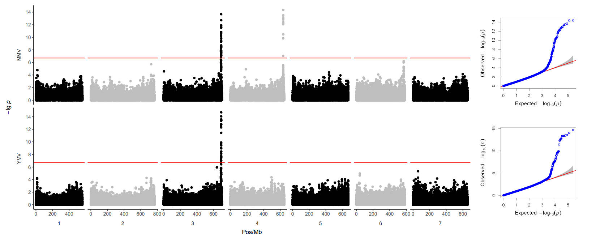
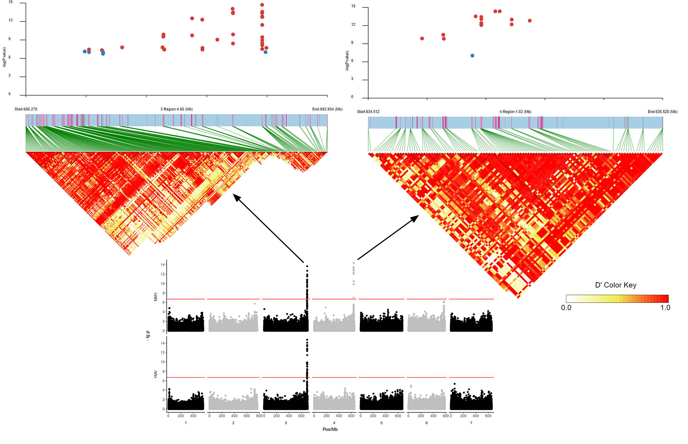

本仓库尝试复现了[Milner et al.](https://doi.org/10.1038/s41588-018-0266-x)有关来自全球种质库的大麦群体遗传研究的论文的部分工作，同时模仿复现文章图片。

由于时间和算力有限，只进行了部分工作的模仿复现。

## 1. 基本信息

作者收集了来自德国IPK-Gatersleben、中国国家作物种质库、瑞士Agroscope国家基因库等机构的共22,626份大麦材料进行了GBS，包括驯化大麦（栽培大麦）和野生大麦。

经过序列比对和变异检测后设定缺失率和杂合率阈值为10%，得到171,263个双等位基因位点。

## 2. 群体结构

作者参考前人研究从22,621（原文如此）份材料中重新划分出19,778份栽培大麦和1,140份野生大麦。

对19,778份栽培大麦进行了PCA。具体步骤：

1. 使用`PLINK --make-bed`将作者提供的栽培大麦数据集（包含76,102个SNP）转换为PLINK bed格式
2. 使用`PLINK --PCA`进行PCA，保留前10个主成分

PCA结果如下：

`NE`：北欧；`WE`：西欧；`FE`：远东；`CA`：中亚；`ME`：中东；`AP`：阿拉伯半岛；`NA`：北非；`ETH`：埃塞俄比亚。

模仿原文根据材料的地理来源进行了颜色标记。结果与原文比较一致，PC1主要区分了西方（欧洲、中东）和东方（亚洲、非洲）的大麦种质，PC2主要区分出了埃塞俄比亚大麦。值得注意的是，前两个主成分的累计方差解释率只有约5%，这表明文章研究的大麦群体结构比较复杂，常规基于特征值分解的PCA事实上不能很好地实现降维，在作者划分的地理范围内仍有亚群体的进一步分化。此外，各种质库收藏的材料中难免有不少混血（admixed）材料，作者没有加以鉴别和剔除，这加剧了群体结构的复杂性。可以推测，这也是作者在后面并没有进行选择消除分析等进一步检测亚群分化的分析的原因。

使用`Admixture`进行了祖先成分分析。结果大致与PCA一致。在K=7时有最多的材料有确定的祖先成分（Qmax > 0.7）。而在K=12时有最低的CV-Error。祖先成分分析的结果还表明，北非材料（`NA`）虽与埃塞俄比亚材料（`ETH`）地理接近，但是其遗传背景更接近西欧（`WE`）；阿拉半岛材料（`AP`）虽与中东（`ME`）地理接近，但是其遗传背景更接近埃塞俄比亚（`ETH`）。

选取K=12时Qmax > 0.7的材料重新绘制PCA结果，亚群分划程度有所改善，暗示了混血材料的存在，不过如前所述作者并未对混血材料加以处理。

使用PopLDdecay统计LD衰减，结果表明中东种质有最高的遗传多样性，这与其作为大麦的起源地的事实是相符的。

由于是GBS简化测序，标记密度较低，使用滑窗取平均的方式绘制的拟合线波动仍然很大，可视化效果不好，还需要改进。

## 3. GWAS

### 3.1 基因型填补

作者对栽培大麦数据集进行了基因型填补（imputation）以提供遗传图谱完整性。使用`FILLIN`，丢弃缺失率>95%、杂合率>1%、minor allele count < 10的位点和杂合率>0.3%、缺失率>10%的样本。填补后过滤掉缺失率>90%、MAF < 1%的位点，获得20,458个样本和306,049个SNP

### 3.2 表型数据

大麦黄花叶病由黄花叶病毒（BaYMV）和温和花叶病毒（BaMMV）独立或混合感染引发。作者选择使用IPK收录的包含约1,894份冬性大麦材料的BaYMV/BaMMV抗性测试的历史记录作为表型数据进行关联分析。

将作者提供的表型数据进行整理（`score_data_transfm.R`）后考察其分布：

可见两种病毒抗性均不是典型的连续分布，而是更接近离散分布的二分类变量，尤其是MMV。这表明性状是由少数主效基因控制的质量性状，或者是“阈值”型的性状。作者在文章中使GAPIT的混合线性模型进行关联分析，而对于二分类变量，线性回归的功效较差，应该考虑基于逻辑回归的关联分析模型。不过考虑到抗病基因克隆实践关注的正是主效基因，加上该研究样本量相当大，所以并无大碍。

作者提供的表型数据存在部分重复，且部分样本无法与SNP数据集对应。因此对关联分析可能由一定影响。

### 3.2 关联分析

使用TASSEL将VCF格式转换为Hapmap，作为GAPIT的输入。选择混合线性模型（MLM），保留前六个主成分控制群体结构。结果如下：

在3号和4号染色体上各检测到一个峰。分别对应着此前已报导的两个抗病位点。该结果与原文一致。

文章内容到此为止。

使用LDPlotShow绘制关联位点附近的局部LD block。结果如下。可见一方面由于是GBS测序，SNP密度较低；另一方面关联位点附近LD水平很高（这与前人文献估计的低重组率是一致的。），导致候选区间相当宽，包含数十个基因。如果需要从头克隆这两个抗病基因，需要结合精细定位。

