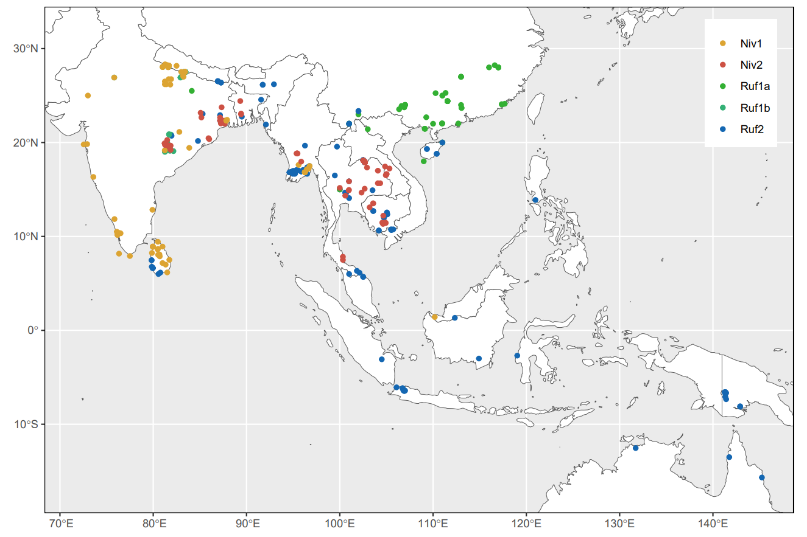
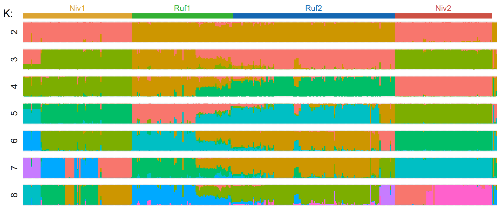
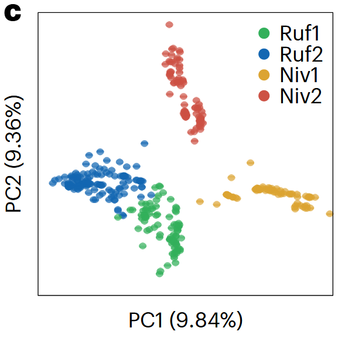
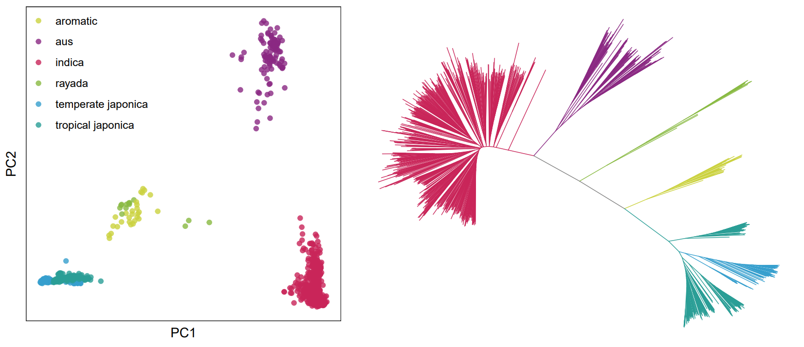
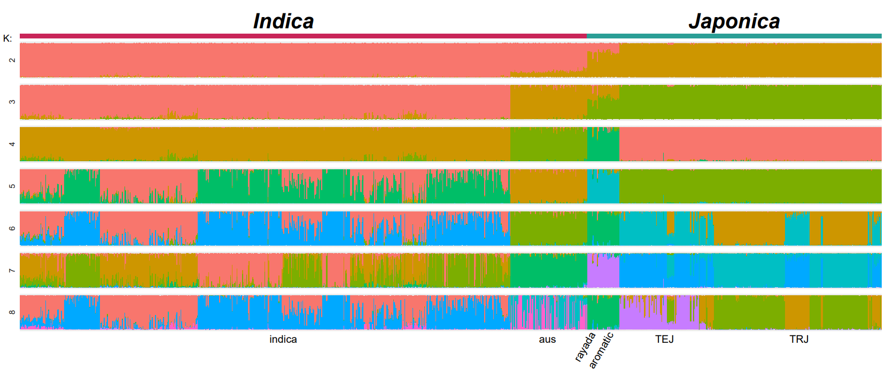
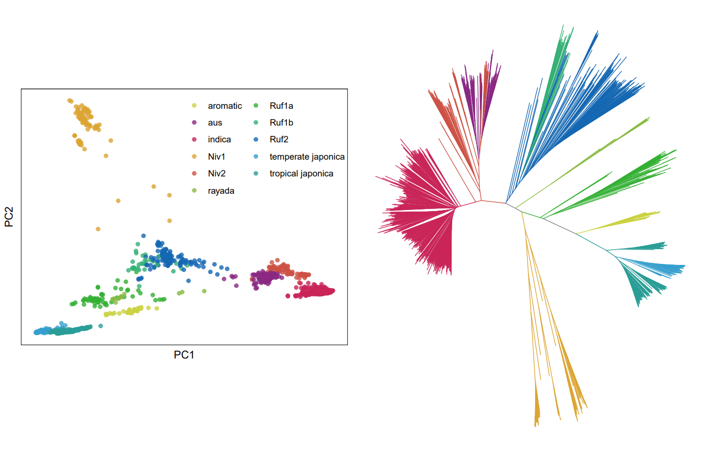
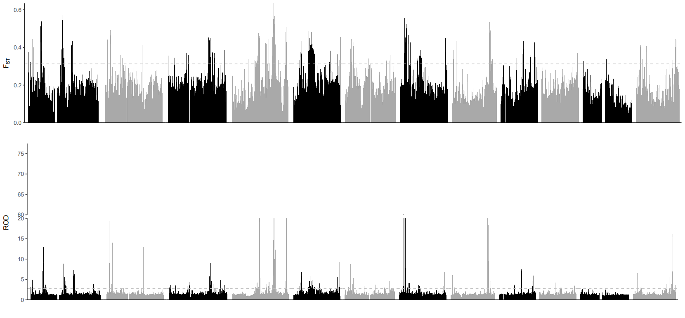
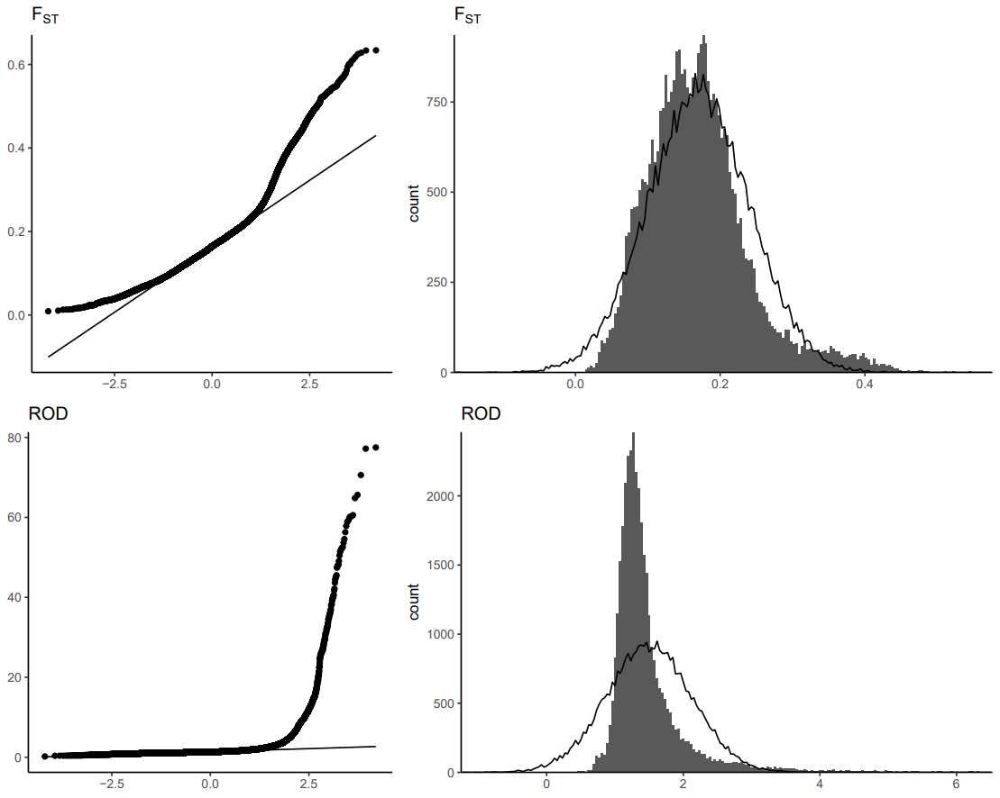
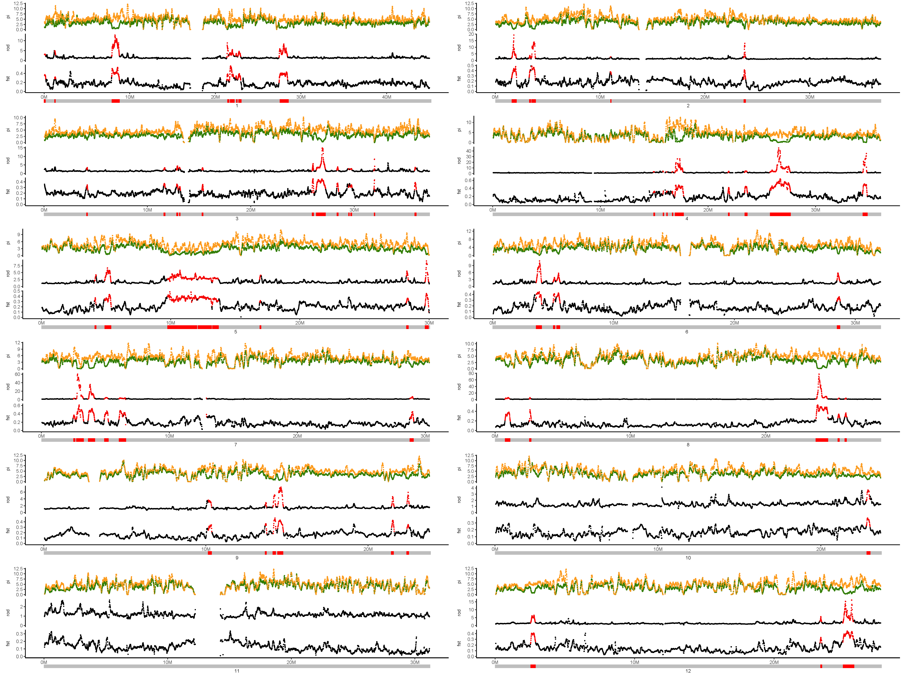
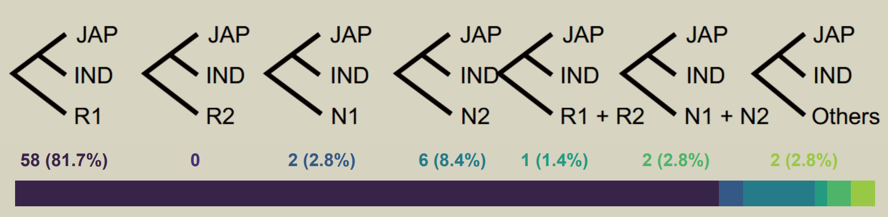

本仓库尝试复现了[Jing et al.](https://doi.org/10.1038/s41477-023-01476-z)有关亚洲栽培稻驯化起源的论文的部分工作，同时模仿复现文章图片。

由于时间和算力有限，只进行了部分工作的模仿复现。

衷心感谢中科院植物所Chun-Yan Jing博士等的指导和帮助。

## 1 基本信息

作者对422份野生稻种质（245个*O. rufipogon*和177个*O. nivara*）和37份地方种（landrace，或栽培稻）进行了重测序，结合已发表数据，共1578份材料，包括457份野生稻和1121份地方种

基于IRGSP build5参考基因组进行比对和变异检测或得约17.2M个SNP（未过滤多等位基因位点，仅进行VQSR过滤+AN>=1578过滤，即缺失率不大于0.5）

根据作者介绍，由于部分亚群个体数量较小，为了避免遗漏关键的差异位点，在大部分情况下都没有对MAF进行控制。

根据作者介绍，后续群体遗传与进化分析在节选亚群体时，没有进行任何进一步的过滤，也没有更新ALT等位基因。这是不严谨的。但是考虑到以模仿复现为主，我依照作者的方法也不做任何过滤。

## 2 野生稻和驯化稻之间的遗传分化

分别使用PCA、Admixture分析了457份野生稻材料，并基于IBS距离建立了NJ树，去除混血材料后剩下404份野生稻材料，结果如下：

结果表明，野生稻群体内部最主要的分化并不是两种野生稻物种的分化。两个野生稻物种各自分化为两个亚组，在Admixture结果中，K=2时最大的分化表现在来自印度和华南的Ruf1/Niv1和来自东南亚的Ruf2/Niv2两组之间。

值得注意的是PCA结果与原文（下图，原文Fig.1 c）有一定差异。经过与作者的讨论得知，作者实际上另有一份对野生稻单独进行变异检测的VCF文件，而不是先野生稻＋栽培稻联合变异检测，然后提取野生稻的SNP。由于作者不愿提供这份单独的野生稻数据集，只能将错就错。

与野生稻同理，对1089份栽培稻进行PCA与Admixture分析并建立NJ树。

结果很好地展示了籼稻和粳稻之间的遗传差异。值得注意的是三种“次要品种”（*aus*、*aromatic*、*rayada*）样本数量较少，分布区域也有限，但是与籼粳稻之间也有明显的遗传分化。

将野生稻与栽培稻数据联合进行群体结构分析：

栽培稻没有形成单系群，而是与部分野生稻混合成簇。具体来说，籼稻(*indica*、*aus*)与*Niv2*形成一个群体，而3个粳稻群体(*aromatic*、温带粳稻和热带粳稻)与华南的一个*O . rufipogon*群体(*Ruf1a*)聚类，而印度北部的*Ruf1b*不直接参与水稻驯化。

## 3 选择清除分析

### 3.1 选择清除区域

对籼稻和温带、热带粳稻进行选择清除分析（次要品种弃去，因为相比籼稻和粳稻遗传差异较大且个体数量少）。作者提出了一种基于选择清除的推测驯化历史的方案。具体步骤：

1. 以窗口100kb、步长10kb扫描基因组，分窗计算$ROD_{Wild/Cultiva}$和$F_{ST}$，只计算SNP数量大于10个的窗口。
2. 剔除$ROD_{W/C}$与均值相差超过两倍标准差的窗口，对两个统计量进行Z变换转换为标准正态分布，取Z>2作为阈值，两个统计量均超过阈值的相邻窗口合并为假定的选择清除区（PSR）
3. 在亚群之间两两计算PSR窗口之内的加权$F_{ST}$得到距离矩阵，建立NJ树。
4. 进化树形成粳稻-籼稻单系的定义为单起源选择清除区（SOR）。
5. 统计SOR的进化树的拓扑结构。

在作者的文章中PSR的筛选是通过自编Perl脚本实现的。相比Perl，Python语言具有更强的可维护性和通用性，因此我全部用Python重写了有关代码，经测试能够输出完全相同的结构。

滑窗统计的$ROD_{Wild/Cultiva}$和$F_{ST}$分布如下，虚线为阈值线：

在实操中我注意到一个问题，过滤前的$ROD$和$F_{ST}$（尤其是$ROD$）均不是正态分布的，且有非常明显的右偏，更加接近泊松分布的形状。在这种情况下选择对数据进行Z变换并按照$\mu+2\sigma$为阈值，恐怕会低估野生稻和栽培稻之间的遗传分化。使用更加合理的理论分布有可能改善分析的结果。

按照文章提供的阈值进行筛选后得到了72个PSR，这比文章结果（98）要少。差异主要体现在分化水平较低的10、11等染色体上：不知为何在我的统计结果中它们没有达到阈值。提取PSR序列建树后得到71个野生稻和栽培稻形成单系的SOR，这一结果则与文章结果非常接近。

黄色和绿色点分别表示野生稻和栽培稻的核苷酸多样性（$\pi$）；红色点表示$ROD$和$F_{ST}$统计量均超出阈值的区域（PSR）；SOR用底部线段图上的红色区域表示。

统计SOR的进化树的拓扑结构，结果如下：

结果表明，大部分（80%）的SOR起源于Ruf1，但是也有14%的SOR起源于Niv1/2，作者（结合选择清除基因的分析）认为这一结果表明了水稻驯化的双重起源，即Ruf和Niv均贡献了驯化相关基因。

### 3.2 选择清除基因

为了进一步揭示驯化基因的来源，作者基于类似的逻辑对IRGSP build5参考基因组中的编码基因进行了类似的选择清除分析。

待完成……

## 4 单倍型分析

作者挑选了部分单起源选择清除基因进行了单倍型分析

待完成……

## 5 基因流分析

待完成……
